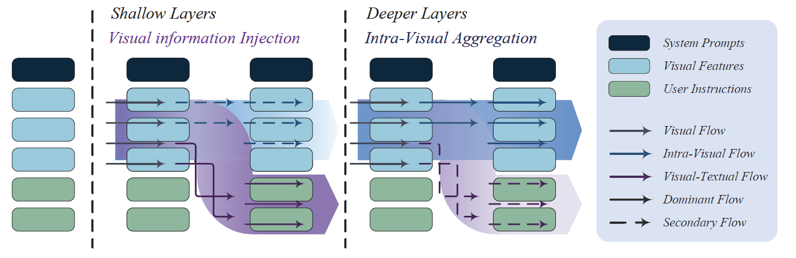
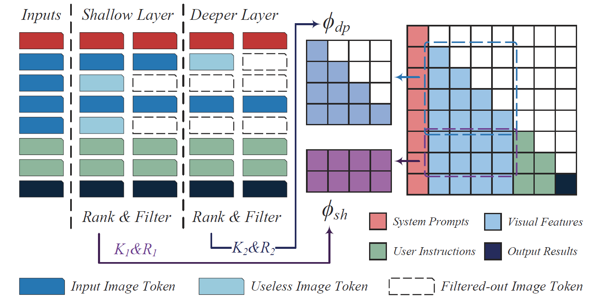

### Unraveling the Shift of Visual Information Flow in MLLMs: From Phased Interaction to Efficient Inference

---

#### Shift in the Dominant Flow of Visual Information

- In shallow layers, strong interactions are observed between image tokens and instruction tokens, where most visual information is injected into instruction tokens to form cross-modal semantic representations

- In deeper layers, image tokens primarily interact with each other, aggregating the remaining visual information to optimize semantic representations within visual molity.



---

#### Hierarchical Modality-Aware Pruning

HiMAP dynamically ranks the importance of image tokens according to the dominant visual information flow at different depths and applies pruning strategies in specified layers. By reducing the computational overhead of both self-attention modules and feed-forward networks modules, HiMAP reduce FLOPs by over 65%.



---

- [x] Setup

- [x] Analysis of Visual Information Flow

- [x] Validation for the proposed hypothesis

- [x] HiMAP Inference & Evaluation

---

#### Setup

```powershell
conda create -n himap python=3.10
conda activate himap
bash setup.sh
```

---

#### Analysis of Visual Information Flow

we provide a script (src/HiMAP/analysis/saliency_scivqa.sh) to reproduce the analysis results of  visual information flow.

```powershell
bash src/HiMAP/analysis/saliency_scivqa.sh
```

or

```bash
export CUDA_VISIBLE_DEVICES=0
python ./src/HiMAP/analysis/saliency_scivqa.py \
    --model-path /code/FasterV/models/llava-v1.5-7b \
    --question-file ./data/scienceqa/himap-inference-MCQ.json \
    --result-file ./output_example/scivqa_props-7b.pt \
    --image-folder ./data/scienceqa/images/test \
    --single-pred-prompt \
    --conv-mode vicuna_v1
```

---

#### Validation for the Proposed Hypothesis

we provide following script to replicate the experiments used to verify our hypothesis.

```powershell
bash src/HiMAP/validate/attn_disruption.sh
```

or

```bash
export CUDA_VISIBLE_DEVICES=0
python ./src/HiMAP/validate/attn_disruption.py \
    --model-path /code/FasterV/models/llava-v1.5-13b \
    --question-file ./data/scienceqa/himap-inference-MCQ-VC-13B.json \
    --image-folder ./data/scienceqa/images/test \
    --single-pred-prompt \
    --isolate-modality img2txt \
    --isolate-layer 5
```

---

#### HiMAP Inference & Evaluation

You could use following code to reproduce HiMAP's latency experiment on scienceqa. We conduct the following experiments on one A800 GPU (80G)

```powershell
bash src/HiMAP/inference/eval_scivqa.sh
```

*Science QA Results*

| Model       | FLOPs Ratio | Accurancy | Latency/Example |
|:-----------:|:-----------:|:---------:|:---------------:|
| 7B Vanilla  | 100%        | 67.9%     | 0.197s          |
| 7B HiMAP    | **24%**     | **68.3%** | **0.116s**      |
| 13B Vanilla | 100%        | 71.6%     | 0.320s          |
| 13B HiMAP   | **23%**     | **72.1%** | **0.158s**      |
